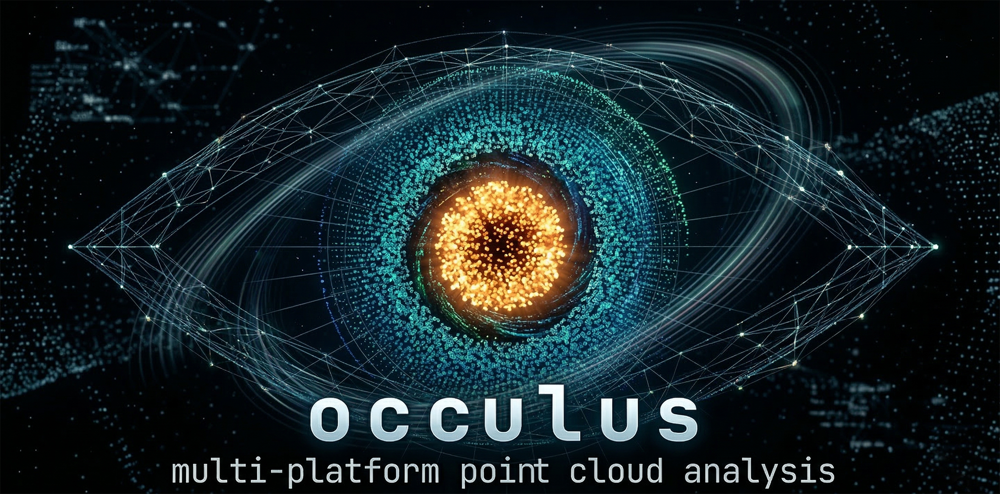

[](https://www.gnu.org/licenses/gpl-3.0)
[](https://www.python.org/)
[](https://hatch.pypa.io/)
[](https://github.com/astral-sh/ruff)
[](https://mypy-lang.org/)
[](https://github.com/chrislyonsKY/occulus/actions/workflows/ci.yml)


[](https://pypi.org/project/occulus/)
[](https://pypi.org/project/occulus/)


<p align="center">
  
</p>

# occulus

**Multi-platform point cloud analysis — registration, segmentation, surface reconstruction, and feature extraction for aerial, terrestrial, and UAV LiDAR.**

Point cloud tooling in Python is fragmented. `laspy` reads files. Open3D visualizes them. PDAL pipelines transform them. But nothing treats *acquisition platform* as a first-class concept — and platform changes everything about how you process the data. Aerial LiDAR at 8 pts/m² from a nadir perspective requires fundamentally different ground classification parameters than a terrestrial scan at 50,000 pts/m² from a tripod. UAV photogrammetric point clouds have different noise characteristics than UAV LiDAR. Today, you adjust every parameter manually, every time.

**occulus** is the point cloud analysis library that knows where your data came from and adapts accordingly. One API. Platform-aware defaults. C++ performance where it matters. NumPy arrays in, NumPy arrays out.

---

## Why occulus?

### The problem

You have a terrestrial laser scan of a bridge abutment and an aerial LiDAR survey of the surrounding floodplain. Both are point clouds. Both are stored as LAS files. But they need completely different processing:

- The aerial data needs CSF ground classification at 2m cloth resolution, tree segmentation, and a canopy height model.
- The terrestrial data needs multi-scan registration (ICP), plane detection for the concrete surfaces, and a Poisson mesh for the structural assessment.

In today's Python ecosystem, you'd use `laspy` to read both, then branch into completely different code paths — Open3D for the TLS registration, some custom NumPy code for the aerial metrics, maybe PDAL for the ground classification. No library understands that these are different *kinds* of point clouds with different processing needs.

### The solution

```python
import occulus

# Read with platform awareness — returns the right subtype
aerial = occulus.read("survey.laz", platform="aerial")
scan = occulus.read("bridge_scan.laz", platform="terrestrial")

# Same function, platform-aware defaults
# Aerial: CSF cloth resolution 2.0m
# Terrestrial: CSF cloth resolution 0.5m (warns about perspective limitations)
aerial_ground = occulus.segmentation.classify_ground(aerial)
scan_ground = occulus.segmentation.classify_ground(scan)

# Platform-specific operations
trees = occulus.segmentation.segment_trees(aerial)  # aerial/UAV workflow
planes = occulus.features.detect_planes(scan)        # TLS/survey workflow

# Universal operations work on any platform
normals = occulus.normals.estimate_normals(scan)
mesh = occulus.mesh.poisson_reconstruct(scan)
```

The API doesn't force you to think about platform differences — it handles them. But when you need to override the defaults, every parameter is exposed.

---

## Features

### Platform-aware type system

```python
from occulus.types import PointCloud, AerialCloud, TerrestrialCloud, UAVCloud

# Base type works for any data
cloud = PointCloud(xyz_array)

# Platform subtypes carry acquisition metadata and provide smart defaults
aerial = AerialCloud(xyz, intensity=intensity, return_number=returns)
tls = TerrestrialCloud(xyz, scan_positions=[pos1, pos2, pos3])
uav = UAVCloud(xyz, is_photogrammetric=True)
```

Each subtype knows its acquisition context:

| Platform | Typical density | Perspective | Key metadata | Default ground params |
|---|---|---|---|---|
| `AerialCloud` | 2–25 pts/m² | Nadir (overhead) | Return number, flight altitude | CSF 2.0m cloth |
| `TerrestrialCloud` | 1,000–100,000 pts/m² | Horizontal | Scan positions, scan angles | CSF 0.5m cloth |
| `UAVCloud` | 20–500 pts/m² | Oblique | Flight trajectory, SfM vs LiDAR flag | CSF 1.5m cloth |

### Registration

Align multiple scans into a common coordinate system.

```python
from occulus.registration import icp, coarse_align, align_scans

# ICP — auto-selects point-to-point or point-to-plane based on normals
result = icp(source, target, max_correspondence_distance=0.5)
print(result.transformation)  # 4x4 rigid transform
print(result.fitness)          # fraction of matched points
print(result.inlier_rmse)     # alignment quality

# Coarse alignment first (FPFH features + RANSAC), then ICP refinement
coarse = coarse_align(source, target, voxel_size=0.5)
refined = icp(source, target, init_transform=coarse.transformation)

# Multi-scan alignment — aligns N scans to a common frame
# For TerrestrialCloud inputs, uses scan positions as initial guesses
aligned = align_scans([scan1, scan2, scan3, scan4])
```

### Segmentation

Separate ground from non-ground, extract individual objects, delineate tree crowns.

```python
from occulus.segmentation import classify_ground, segment_objects, segment_trees

# Ground classification — platform-aware defaults
ground = classify_ground(cloud)  # algorithm and params selected by platform
print(f"{ground.n_ground} ground points, {ground.n_nonground} non-ground")

# Force a specific algorithm
ground = classify_ground(cloud, algorithm="pmf", max_distance=1.0)

# Object segmentation — DBSCAN, region growing, or connected components
objects = segment_objects(non_ground_cloud, method="dbscan", eps=0.5)
print(f"Found {objects.n_segments} objects")

# Tree segmentation — watershed or point-based methods
trees = segment_trees(aerial_cloud, method="watershed", min_height=2.0)
```

### Surface reconstruction

Build meshes from point clouds for visualization, volume computation, and structural analysis.

```python
from occulus.mesh import poisson_reconstruct, ball_pivot, alpha_shape

# Poisson — watertight, requires normals
cloud = occulus.normals.estimate_normals(cloud)
mesh = poisson_reconstruct(cloud, depth=10)
print(f"{mesh.n_vertices} vertices, {mesh.n_faces} faces")

# Ball Pivoting — handles boundaries and holes naturally
mesh = ball_pivot(cloud, radii=[0.05, 0.1, 0.2])

# Alpha shape — concavity-respecting boundary
mesh = alpha_shape(cloud, alpha=0.5)

# All mesh results have the same interface
mesh.to_open3d()  # Open3D interop
```

### Feature extraction

Detect geometric primitives — planes, cylinders, edges — from structured scenes.

```python
from occulus.features import detect_planes, detect_cylinders, detect_edges

# RANSAC plane detection — iteratively finds the N largest planes
planes = detect_planes(cloud, distance_threshold=0.02, max_planes=5)
for p in planes:
    print(f"Plane: {p.n_inliers} points, RMSE={p.rmse:.4f}m, normal={p.normal}")

# Cylinder detection — pipes, poles, tree trunks
cylinders = detect_cylinders(cloud, radius_range=(0.05, 0.5))
for c in cylinders:
    print(f"Cylinder: r={c.radius:.3f}m, {c.n_inliers} points")

# Edge detection — boundaries, creases, corners
edges = detect_edges(cloud, k_neighbors=30, angle_threshold=60)
```

### Filtering

Clean, downsample, and crop point clouds.

```python
from occulus.filters import (
    voxel_downsample, statistical_outlier, radius_outlier, crop, random_downsample
)

# Voxel grid downsampling
small = voxel_downsample(cloud, voxel_size=0.1)

# Statistical Outlier Removal (SOR)
clean, inlier_mask = statistical_outlier(cloud, k_neighbors=20, std_ratio=2.0)

# Radius outlier removal
clean, mask = radius_outlier(cloud, radius=0.5, min_neighbors=5)

# Spatial crop
roi = crop(cloud, bounds=(xmin, ymin, zmin, xmax, ymax, zmax))

# Random subsample
subset = random_downsample(cloud, fraction=0.1, seed=42)
```

### Normal estimation

Compute and orient surface normals.

```python
from occulus.normals import estimate_normals, orient_normals

# PCA-based normal estimation
cloud = estimate_normals(cloud, k_neighbors=30)

# Orient normals toward a known viewpoint (TLS scanner position)
cloud = orient_normals(cloud, viewpoint=scan_position.as_array())

# Or orient via minimum spanning tree (when viewpoint is unknown)
cloud = orient_normals(cloud, method="mst")
```

### Metrics

Summary statistics, canopy height models, density analysis.

```python
from occulus.metrics import compute_metrics, canopy_height_model, point_density_map

# Full summary statistics
stats = compute_metrics(cloud)
print(f"Points: {stats.n_points:,}")
print(f"Density: {stats.point_density:.1f} pts/m²")
print(f"Z range: {stats.z_min:.1f}–{stats.z_max:.1f}m")
print(f"Median elevation: {stats.z_percentiles[50]:.1f}m")

# Canopy Height Model — aerial/UAV workflow
chm, x_edges, y_edges = canopy_height_model(aerial_cloud, resolution=1.0)

# Point density map
density, x_edges, y_edges = point_density_map(cloud, resolution=2.0)
```

### I/O

Read and write LAS, LAZ, PLY, PCD, and XYZ formats.

```python
import occulus

# Read with platform hint — returns the right subtype
cloud = occulus.read("scan.laz", platform="terrestrial")
cloud = occulus.read("survey.las", platform="aerial")
cloud = occulus.read("model.ply")  # platform="unknown" by default

# Subsample on read
cloud = occulus.read("huge_dataset.laz", subsample=0.1)  # keep 10%

# Write
occulus.write(cloud, "output.laz")       # compressed
occulus.write(cloud, "output.las")       # uncompressed
occulus.write(cloud, "output.ply")       # PLY format
occulus.write(cloud, "points.xyz")       # delimited text
```

### Visualization

Optional Open3D integration for interactive viewing.

```python
from occulus.viz import show, show_registration, show_segmentation

# Quick view
show(cloud)
show(cloud1, cloud2)  # multiple clouds

# Visualize registration result
show_registration(source, target, icp_result)

# Visualize segmentation with colored labels
show_segmentation(cloud, segmentation_result)
```

---

## Architecture

### C++ core, Python API

Performance-critical algorithms (ICP, k-d tree queries, RANSAC, CSF, normal estimation) are implemented in C++ and exposed via pybind11. The Python layer provides the API, type system, and orchestration.

```
occulus/
├── src/occulus/           ← Python API (types, dispatch, orchestration)
│   ├── types.py           ← PointCloud, AerialCloud, TerrestrialCloud, UAVCloud
│   ├── io/                ← LAS/LAZ/PLY/PCD/XYZ readers and writers
│   ├── registration/      ← ICP, coarse alignment, multi-scan fusion
│   ├── segmentation/      ← Ground classification, object/tree segmentation
│   ├── mesh/              ← Poisson, BPA, alpha shape reconstruction
│   ├── features/          ← RANSAC plane/cylinder, edge detection
│   ├── metrics/           ← Statistics, CHM, density maps
│   ├── filters/           ← Voxel downsample, SOR, radius outlier, crop
│   ├── normals/           ← PCA normal estimation, orientation
│   ├── viz/               ← Open3D visualization helpers
│   └── _cpp/              ← pybind11 bindings to C++ core
└── cpp/                   ← C++ source (k-d tree, ICP, RANSAC, CSF, meshing)
```

### NumPy-native

Every function takes NumPy arrays and returns NumPy arrays. No proprietary object formats to learn. The `PointCloud` class is a thin wrapper around `ndarray` attributes — you can always access `cloud.xyz` as a raw `(N, 3)` float64 array.

### Open3D interop

Convert between occulus and Open3D objects in both directions:

```python
o3d_cloud = cloud.to_open3d()        # occulus → Open3D
cloud = PointCloud.from_open3d(pcd)   # Open3D → occulus
mesh.to_open3d()                      # mesh → Open3D TriangleMesh
```

---

## Install

```bash
pip install occulus
```

Optional extras:

```bash
pip install occulus[las]    # LAS/LAZ support via laspy
pip install occulus[viz]    # Open3D visualization + matplotlib
pip install occulus[all]    # Everything
```

### Requirements

- Python 3.11+
- NumPy 1.24+
- A C++ compiler for building from source (prebuilt wheels provided for major platforms)

---

## Companion: parallax (R)

occulus has a companion R package — [**parallax**](https://github.com/chrislyonsKY/parallax) — providing the same capabilities with R-native idioms. Same concepts, same algorithm names, independent implementations optimized for each ecosystem.

| | **occulus** (Python) | **parallax** (R) |
|---|---|---|
| Core | C++ via pybind11 | Rust via extendr |
| Returns | NumPy arrays | S3/S7 classes, tibbles |
| Interop | Open3D, laspy | sf, terra, lidR |
| Registry | PyPI | CRAN |

Both packages share test fixtures, documentation structure, and API concepts. A workflow learned in one transfers directly to the other.

---

## Use cases

### Environmental monitoring

- Pre/post mining land disturbance analysis from aerial LiDAR
- Floodplain mapping from UAV surveys
- Canopy height and forest inventory from aerial/UAV platforms
- Stream channel morphology from terrestrial scanning

### Surveying and engineering

- Multi-scan TLS registration for as-built documentation
- Bridge and structure inspection from terrestrial point clouds
- Volumetric computation from mesh reconstruction
- Plane detection for building facade analysis

### Research

- Custom segmentation algorithm development with platform-aware test data
- Multi-epoch change detection workflows
- Cross-platform point cloud comparison (aerial vs. terrestrial vs. UAV)
- Reproducible processing pipelines with explicit parameter tracking

---

## Development

```bash
git clone https://github.com/chrislyonsKY/occulus.git
cd occulus
pip install -e ".[dev]"

# Tests
pytest                          # unit tests (mocked I/O)
pytest -m integration           # integration tests (real files)

# Quality
ruff check src/ tests/          # lint
ruff format src/ tests/         # format
mypy src/                       # type check
```

### Contributing

See [CONTRIBUTING.md](CONTRIBUTING.md) for development standards, git conventions, and the architecture overview.

### AI-assisted development

This project uses structured AI development infrastructure. See `ai-dev/` for architecture docs, agent configurations, decision records, and guardrails that guide both human and AI contributors.

---

## License

GPL-3.0 — see [LICENSE](LICENSE).

## Author

**Chris Lyons** — GIS Developer, Kentucky Energy & Environment Cabinet
- GitHub: [@chrislyonsKY](https://github.com/chrislyonsKY)
- Email: chris.lyons@ky.gov
