# Examples

Runnable scripts demonstrating Occulus in action.
Each script is self-contained — install the package, run the script.

## Why so many scripts?

Occulus has 10 core modules (I/O, filters, normals, registration, segmentation,
mesh, features, metrics, visualization, types). Rather than one monolithic demo,
**each script intentionally focuses on 1–2 modules** so readers can see exactly
what a specific component does without wading through unrelated code. A terrain
script might only use `io` + `segmentation`; a registration script only uses
`filters` + `registration`. The one exception is `coal_mine_terrain.py`, which
is an explicit "full toolkit" demo that exercises all modules together.

The output gallery below shows results from real public-domain LiDAR — USGS 3DEP,
KY From Above, and OpenTopography — across diverse terrain types (desert, forest,
urban, coastal, canyon, wetland, mine, fault zone). Every image is generated
programmatically by its script; nothing is hand-edited.

## Scripts

### Real-World Terrain Analysis (USGS 3DEP / OpenTopography)

| Script | What it shows |
|---|---|
| `kentucky_ground_classification.py` | CSF ground classification on Kentucky ALS data |
| `kyfromabove_terrain_survey.py` | KY From Above LiDAR terrain survey via AbovePy |
| `colorado_rocky_mountain_terrain.py` | High-relief terrain analysis — Colorado Front Range |
| `arizona_desert_terrain.py` | CSF + PMF ground classification on Sonoran Desert terrain |
| `utah_canyon_geology.py` | Canyon geology — vertical cliff cross-sections |
| `oregon_coast_terrain.py` | Pacific coastal terrain — Heceta Head, Oregon |
| `louisiana_wetlands_delta.py` | Low-relief wetlands — Atchafalaya Basin, Louisiana |
| `houston_urban_density.py` | Urban LiDAR density analysis — Houston, TX |
| `urban_building_detection.py` | Building detection via point density + planarity — Chicago, IL |
| `pacific_northwest_forest.py` | Old-growth forest inventory — Willamette NF, Oregon |
| `iran_fault_geomorphology.py` | Fault geomorphology — Sabzevar, NE Iran (OpenTopography) |
| `netherlands_ahn4_polder.py` | Below-sea-level polder terrain — AHN4, Netherlands |

### Forest & Canopy

| Script | What it shows |
|---|---|
| `canopy_height_model.py` | CHM raster generation from classified ALS |
| `forest_inventory.py` | Full forest inventory — CHM, tree detection, crown stats |
| `tree_individual_segmentation.py` | CHM-watershed individual tree segmentation |

### Ground Classification

| Script | What it shows |
|---|---|
| `ground_comparison_csf_pmf.py` | Side-by-side CSF vs PMF ground classification |
| `pmf_ground_classification.py` | Progressive Morphological Filter ground classification |

### Terrain & Geomorphology

| Script | What it shows |
|---|---|
| `slope_aspect_analysis.py` | Slope and aspect rasters from ground-classified ALS |
| `full_als_workflow.py` | End-to-end aerial LiDAR pipeline (read → classify → CHM → mesh) |
| `karst_topography.py` | Karst terrain feature detection — sinkholes and ridges |
| `flood_terrain_analysis.py` | Flood-prone terrain analysis from LiDAR DEMs |
| `coal_mine_terrain.py` | **Full toolkit demo** — every Occulus module on Appalachian coal mine terrain |
| `landslide_monitoring.py` | Slope stability and landslide susceptibility analysis |
| `urban_terrain_model.py` | Urban digital terrain model generation |

### Registration

| Script | What it shows |
|---|---|
| `icp_point_to_point_demo.py` | Point-to-point ICP registration |
| `icp_point_to_plane_demo.py` | Point-to-plane ICP registration |
| `global_fpfh_registration.py` | FPFH + RANSAC global registration |
| `usgs_3dep_icp_registration.py` | ICP registration on real USGS 3DEP tiles |
| `tls_multi_scan_registration.py` | Multi-scan TLS registration pipeline |
| `building_facade_registration.py` | Building facade point cloud registration |
| `change_detection.py` | Multi-epoch change detection via registration |

### Segmentation & Features

| Script | What it shows |
|---|---|
| `dbscan_urban_objects.py` | DBSCAN clustering for urban object extraction |
| `building_roof_planes.py` | RANSAC plane detection on building roofs |

### Utilities

| Script | What it shows |
|---|---|
| `las_to_xyz_converter.py` | Batch LAS/LAZ to XYZ format conversion |
| `batch_tile_processing.py` | Parallel processing of multiple LiDAR tiles |

## Running

```bash
pip install occulus[all]
python examples/scripts/kentucky_ground_classification.py
```

Most scripts accept `--no-viz` to skip the interactive 3D viewer and `--input` to use a local file:

```bash
python examples/scripts/colorado_rocky_mountain_terrain.py --no-viz
python examples/scripts/forest_inventory.py --input path/to/your.laz
```

## Notebooks

Interactive examples are in `examples/notebooks/`.
Launch with:

```bash
pip install occulus[all] jupyter
jupyter lab examples/notebooks/
```

## Outputs

Real-world output images from example scripts are saved to `examples/outputs/`.
Each image is generated from public-domain LiDAR data with WCAG 2.1 AA-compliant
styling (colorblind-safe colormaps, ≥4.5:1 text contrast, embedded alt-text metadata).

| Output | Script | Modules used |
|---|---|---|
| 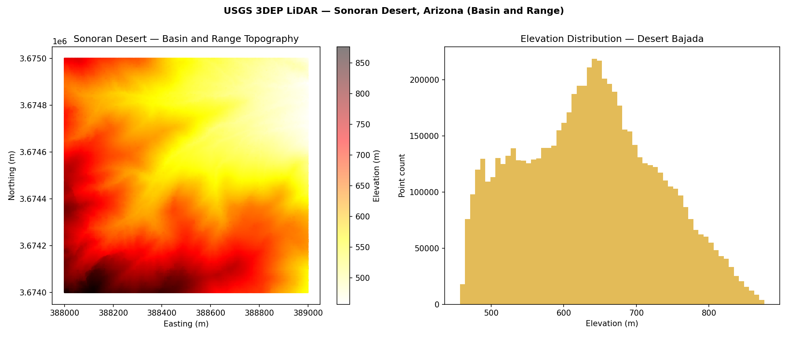 | `arizona_desert_terrain.py` | io, segmentation |
| 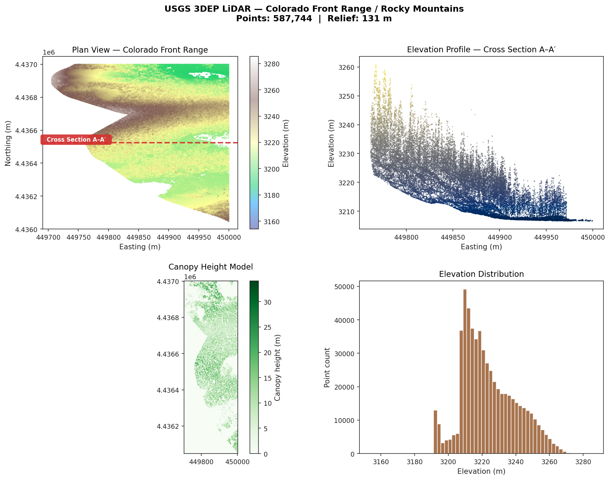 | `colorado_rocky_mountain_terrain.py` | io, segmentation, metrics |
| 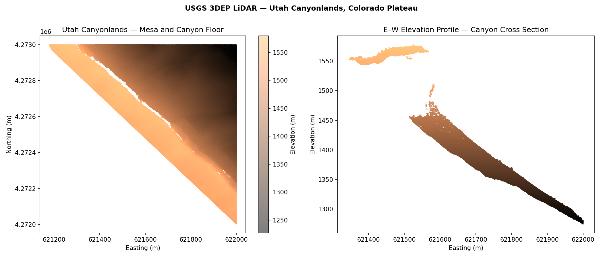 | `utah_canyon_geology.py` | io, segmentation, metrics |
| 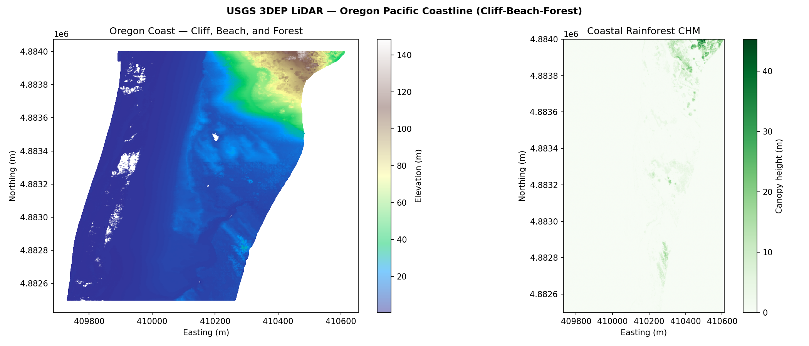 | `oregon_coast_terrain.py` | io, segmentation, metrics |
| 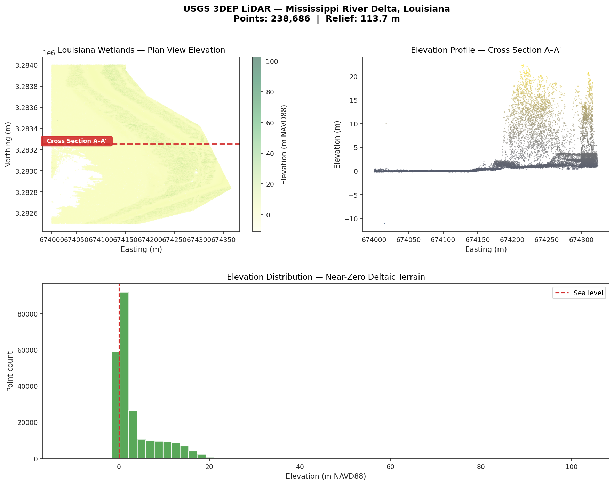 | `louisiana_wetlands_delta.py` | io, segmentation, metrics |
| 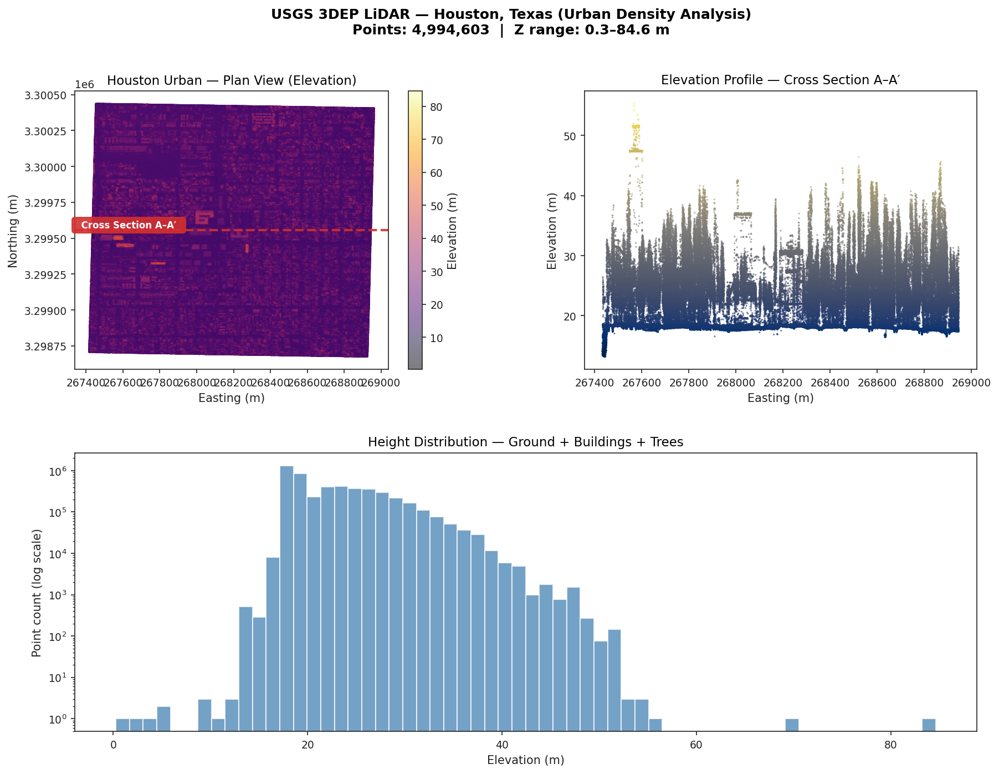 | `houston_urban_density.py` | io, segmentation, metrics |
| 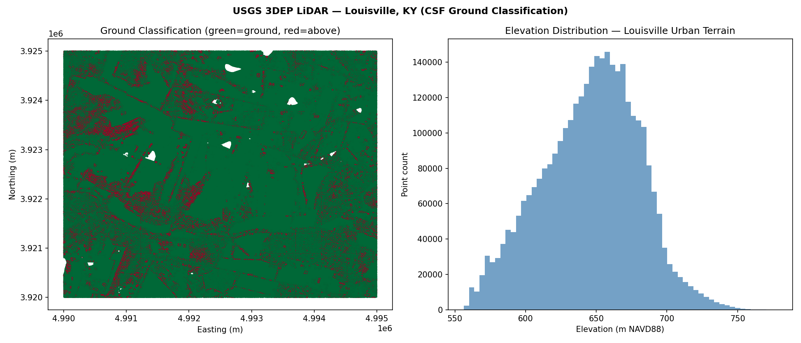 | `kentucky_ground_classification.py` | io, segmentation |
| 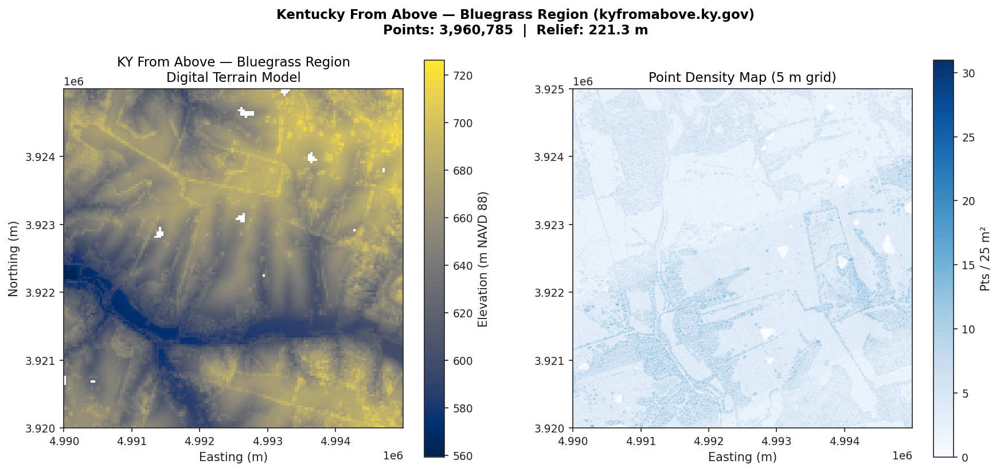 | `kyfromabove_terrain_survey.py` | io, filters, segmentation |
| 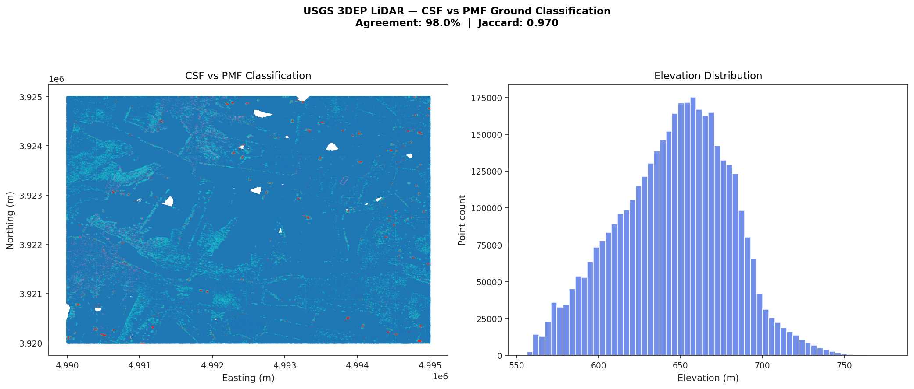 | `ground_comparison_csf_pmf.py` | io, segmentation |
| 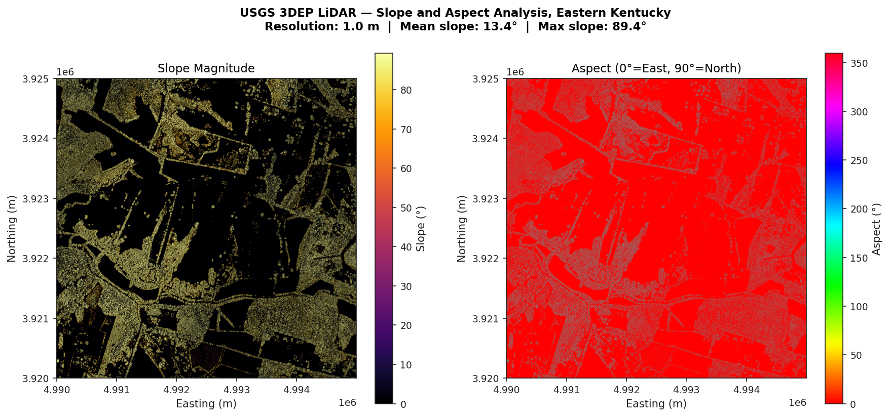 | `slope_aspect_analysis.py` | io, segmentation, metrics |
| 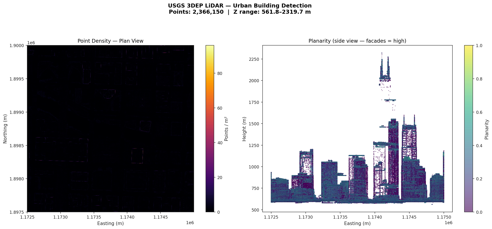 | `urban_building_detection.py` | io, features, metrics |
| 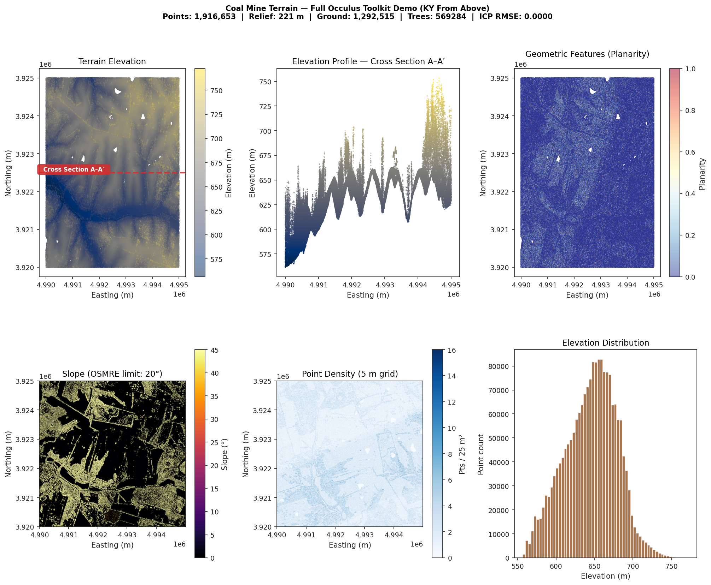 | `coal_mine_terrain.py` | all modules |
